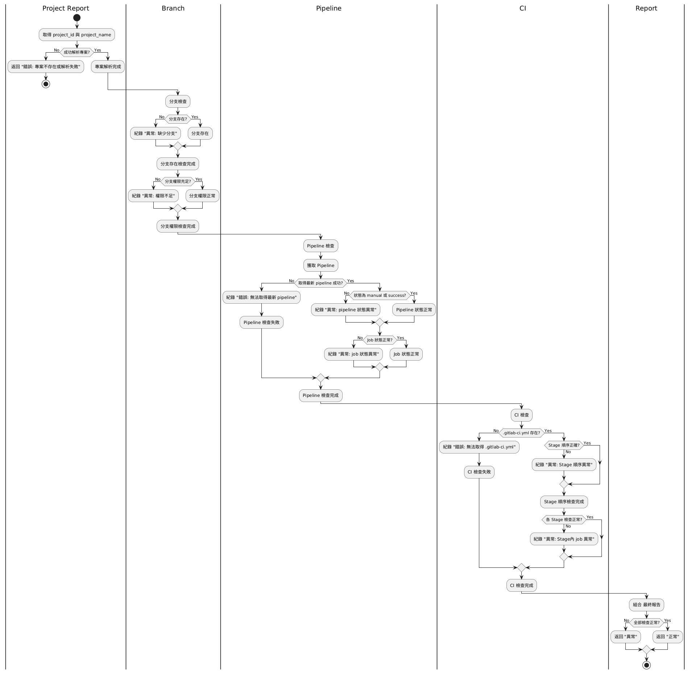
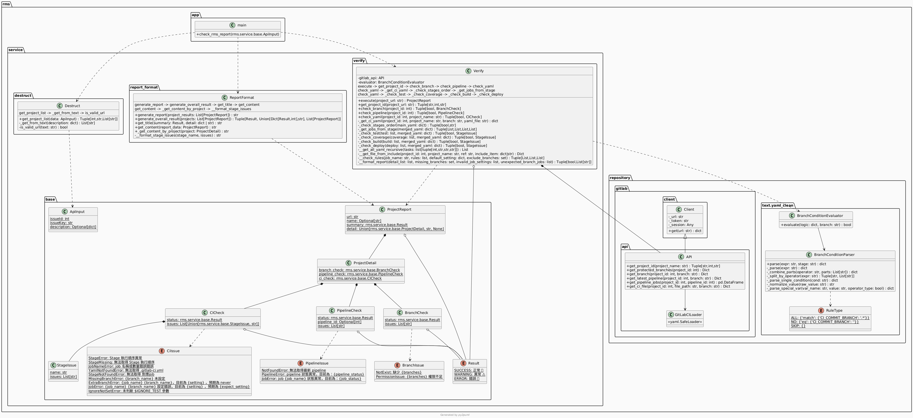
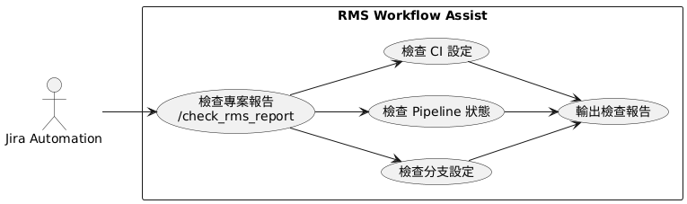
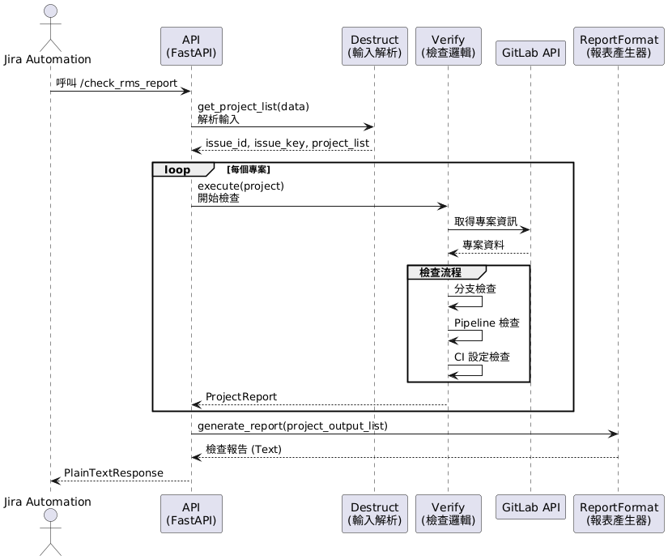
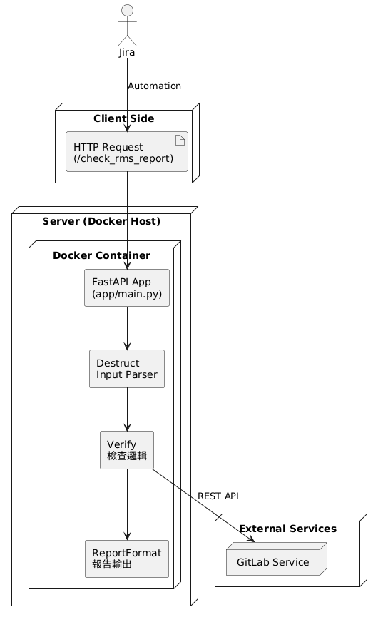

# RMS Workflow Assist

**Python 3.11**

---

## 📌 專案簡介

RMS 簽核輔助系統，用於自動檢查 GitLab 專案是否符合公司規範，並生成檢查報告。

---

## 1️⃣ 專案檢查報告 API

- **路徑**：`/check_rms_report`
- **說明**：檢查 GitLab 專案設定與流程，並輸出詳細報告

---

## 2️⃣ 活動圖

檢查流程活動圖：



---

## 3️⃣ 規範檢查項目

### 🔹 分支設定

- 必須存在：
    - `originmain`
    - `staging-*`
    - `prod-*`
- 分支權限必須 ≥ **Developer + Maintainer**

### 🔹 Pipeline 檢查

- `originmain` 最新 pipeline 狀態：`blocked` 或 `success`
- Coverage Job：`manual`
- 其他 Job：`success`

### 🔹 CI 設定

#### Stage 順序

1. `lint`
2. `test`
3. `build`
4. `coverage / deploy`

#### Stage: test

- 允許 `$IGNORE_TEST` 判斷
- hotfix / prod 分支 Job 為 `manual`

#### Stage: coverage

- 僅適用於 `originmain`
- Job 為 `manual`

#### Stage Job 狀態

- 必須為 `on_success` 或 `always`

#### Deploy / Build Job

- Job 為 `manual`
- 不適用於 `originmain`

---

## 4️⃣ 系統設計 UML

### 🗂 類別圖



### 📌 用例圖



### 📌 序列圖



### 📌 部署圖



---

## 🚀 快速上手

```bash
# 安裝依賴
pip install -r requirements.txt

# 啟動服務
uvicorn app.main:app --host 0.0.0.0 --port 8000 --reload
